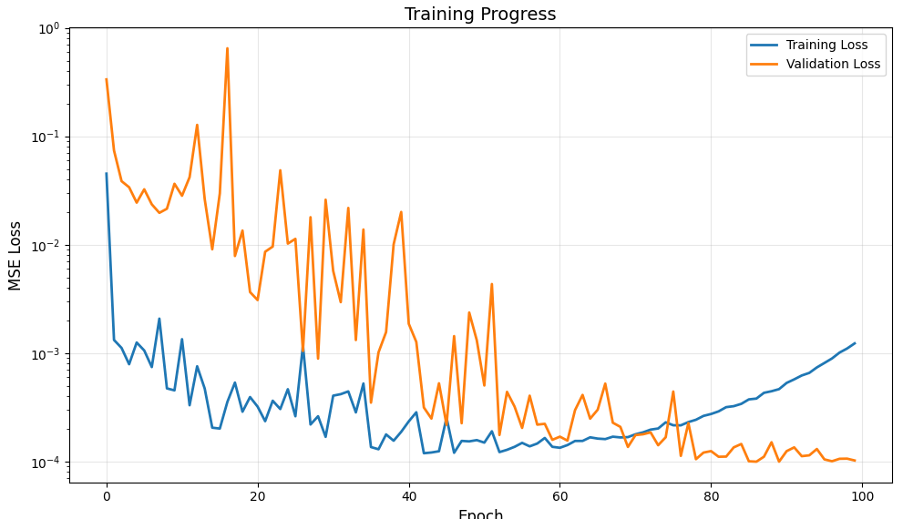
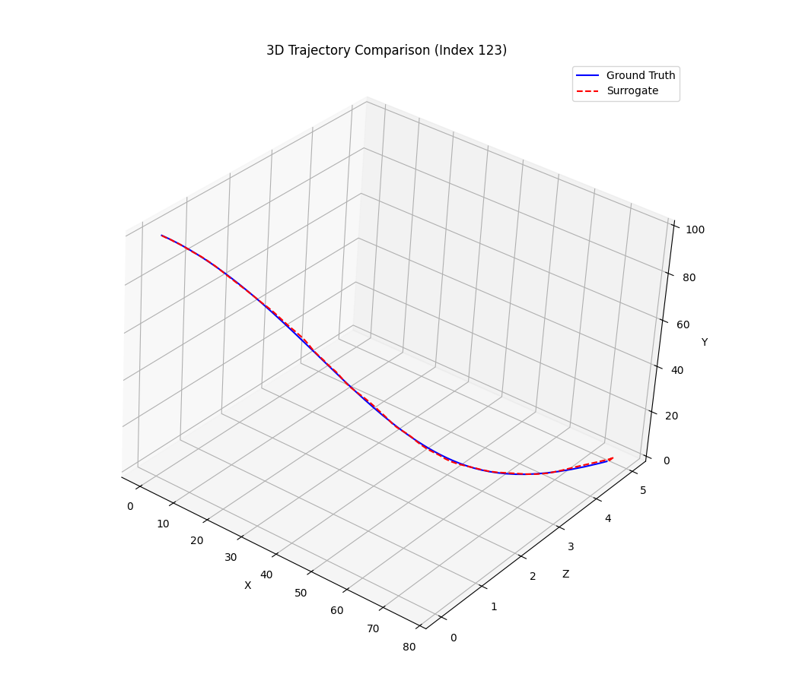
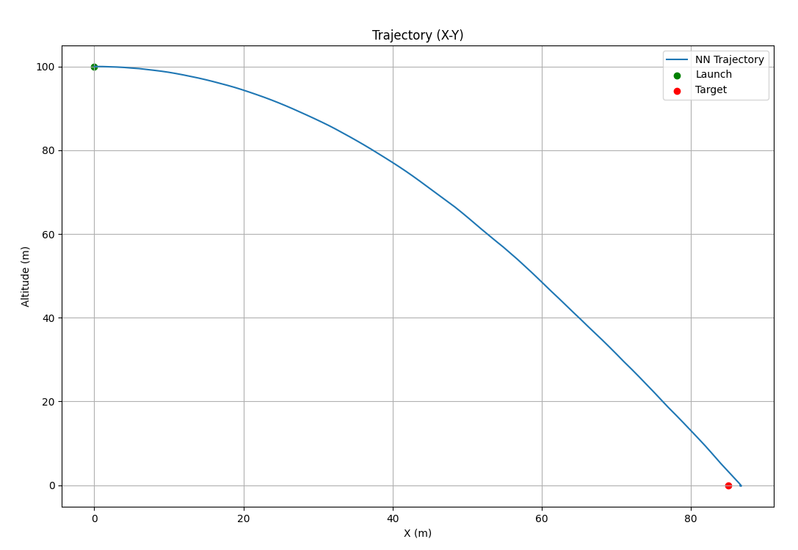

# Guided-Trajectory-Neural-Net
This project builds a machine-learning surrogate model using data generated from a quasi-6-DoF physics simulator replacing numerical integration with a neural network that can predict full 3-D trajectories including altitude, downrange motion, and lateral deflection hundreds of times faster while maintaining meter-level accuracy.

This repository builds directly on the physics engine from my companion project Trajectory-Monte-Carlo:
https://github.com/Ultravis66/Trajectory-Monte-Carlo

In that project, a quasi-6-DoF GnC model was created to simulate thousands of trajectories under randomized target and wind conditions. This repository extends that work into the machine-learning domain by generating a large fixed-size dataset and training a neural network surrogate that can emulate projectile flight with orders-of-magnitude speedup.

1. Physics-Based Dataset Generation (100,000 Trajectories)

A custom RK4 integrator produces full trajectory histories for each Monte Carlo run, saving the state vector (position, velocity, quaternion, rates) at a fixed 20 Hz sampling rate. This guarantees consistent tensor shapes required for neural-network training. Outputs include:

trajectory_ml_dataset.csv: Summary stats per run

trajectories.npz: All input features, trajectories, and times in a compressed structure

Each sample includes the 7-dimensional input vector:
[x_target, z_target, range, bearing, wx, wz, wind_speed]
and a 200-step trajectory of 13 states.

2. Neural Network Surrogate Model (PyTorch)

The model uses a two-stage architecture:

MLP Encoder: Maps the 7 input features to a high-dimensional latent representation

LSTM Decoder: Autoregressively predicts the projectile’s 3D path (x, y, z) over time

The training pipeline includes mixed precision (AMP), teacher forcing, a Reduce-LROn-Plateau scheduler, and validation monitoring. After 100 epochs:

3. Neural Network Surrogate Model (PyTorch)
- mean_trajectory_error: 0.2518 m
- max_trajectory_error: 2.9245 m
- mean_final_position_error: 0.4159 m
- std_final_position_error: 0.2601 m
- std_final_position_error: 0.2601 m
- median_final_position_error: 0.3590 m
- 95th_percentile_error: 0.9205 m

4. Performance
- Neural network: 12,923 trajectories/sec
- Neural network: 12,923 trajectories/sec
- Physics sim: ~30 trajectories/sec
- Physics sim: ~30 trajectories/sec
- Speedup: 431x faster!
- Speedup: 431x faster!

The surrogate model runs on GPU at 12,923 trajectories/sec (in my case a 4070 ti Super), compared to ~30/sec for the physics integrator delivering a 431× speedup. This enables:

Real-time Monte Carlo studies
Rapid guidance law evaluation
Control system prototyping
Embedded feasibility exploration
Included in this repository
Dataset generator (Monte Carlo + fixed-size RK4 trajectories)
Full PyTorch training script
Pretrained model checkpoint
Example inference script for fast evaluation
Visualization tools for training curves and trajectory comparison
This project demonstrates how classic flight-dynamics simulation can be fused with deep learning to create a high-speed surrogate suitable for research, guidance development, and rapid design iteration.

1. Training Curve Loss vs Epochs

File: Training.png
This plot shows the full training and validation loss history over 100 epochs.
You can clearly see the LSTM decoder learning the underlying projectile dynamics and steadily reducing prediction error.

  

2. Ground Truth vs Surrogate (3D Overlay)

File: TruthvsSurrogate.png
This figure compares the neural surrogate trajectory against the ground-truth physics-based trajectory for a random sample from the dataset (real Monte Carlo run).

Blue = Ground truth RK4 trajectory

Red dashed = Neural surrogate prediction

The overlay demonstrates how closely the neural model reconstructs the 3-D flight path.

  

3. XY View of Surrogate Prediction

File: XY_Trajectory.png
This is a clean 2-D X–Y view of a predicted trajectory generated by the stand-alone inference script (traj_surrogate.py).
It visualizes:

Launch point

NN-predicted flight arc

Target location

  

